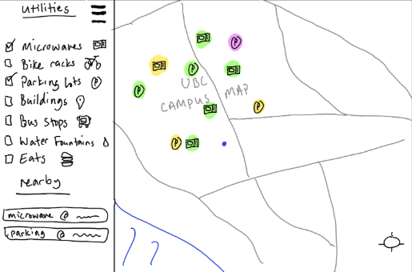

# Problem

With UBC having such a large campus, finding individual utilities that are nearby in a timely manner can be difficult – especially for new students with little to no experience navigating campus. Spending unnecessary amounts of time searching for a bike cage or parking lot can be really frustrating, and even more so between classes. The majority of the available information for utility locations is usually scattered across static maps, outdated websites, or buried within other services. Additionally, no single source provides filtered views of different utility categories, and they do not offer user-generated feedback on the quality or state of those utilities (ie, a bike rack being blocked by construction or a clubroom that has been moved elsewhere). How can a student easily locate working utilities by category without endlessly searching through maps, or digging through pages on outdated websites?

# Solution

Our idea is an interactive map of UBC’s campus with pinned locations of utilities that a student or visitor might want to find. There will be a checkbox menu where users can choose what categories of utilities to display on the board, and each checked category will display all of those utility locations on the map as its corresponding image (for example, checking the “Bike Cages” and “Parking Lots” options will display all of the bike cages and parking lots on UBC’s campus on an interactive map). This menu (which is scrollable) will also show nearby utilities to the user (only ones that are checked in the utility checklist). 

These waypoints can then be clicked on to display another small menu containing all necessary information about that waypoint (for example, a user clicks on a bus stop waypoint, a menu slides out from the right and shows the stop number, road address, etc). This small menu will also include options to get directions (by which the user will be redirected to google maps navigation) or an option to report any issues. If the report issue button is pressed, a small menu will appear in the middle of the page and users will be able to choose a category of issue and add comments. Clicking on a waypoint in the “nearby” menu is the same as clicking on the waypoint in the map. 

To simplify the navigation process, users can also tap anywhere on the map and the nearest utility (only groups that are checked in the previously mentioned menu) will be highlighted. In addition, each waypoint on the map for each utility will have a different highlight (green, yellow, red). Once the nearest utility is identified, the user can choose to click on the waypoint and get directions via google maps. 

Another feature that we will integrate is a simple location api. The map will also display the user’s current location as a blue dot. There will also be a button on the bottom right that will zoom in on the user’s current location.

Below are sketched mockups of what we want our website to look like and further descriptions of what inputs are possible and how the program will react (walk through).

# Walk through: Interface and All Possible States

Sketch 0: Above is what we want our website to look like as soon as it gets opened. It will be a basic UBC campus map, and in the top left corner, we have the 3 grid lines for the “Utility” and “Nearby Utilities” menu.  The current location of the user is also shown now (blue dot) and the “where am I?” button is also in the bottom right. This will always be displayed on the map.

Sketch 1: Above is what the interface will look like with the menu grid lines pressed. It opens a sidebar menu where the user can check off categories of utilities and also see nearby utilities of the same categories. In this sketch, the user has not selected any categories yet, so the map is still empty, and the nearby menu is also empty.

Sketch 2: Above is what the interface will look like if the user has a few utility categories checked, and the menu still open. The waypoints corresponding to each category (microwaves and parking lots) are now displayed on the map and are highlighted in different colours to represent their working status. Green is fully working, yellow means that some issues have been reported, and pink means it is out of service. Additionally, the nearby utilities menu has been updated and shows the nearby utilities based on the checked categories.

Sketch 3: Above is what the interface looks like if the user selected a few categories of utilities and then closed the sidebar menu.

Sketch 4: In the above state, the user has the sidebar menu closed, a few utility categories selected, and has also clicked on the map at the “x”. The map will then show the two closest utility locations for each category in a red box. With only microwaves and parking lots selected, there are two results for “closest utilities,” one for each category. 

Sketch 5: In this state, the user has clicked on the pink parking lot icon, which opened the information menu for that waypoint. Clicking on a waypoint in the nearby menu will open the same menu. This menu will show necessary information (like address, landmarks to help with identification, etc), as well as the working status, and two buttons. The working status (as mentioned previously) will be colour coded, and in this example, the user clicked on a parking lot that was out of service, hence the “not working” message in the menu. The two buttons are the “navigate” and “report issue” options. Clicking on “navigate” will redirect the user to a google maps navigation trip to the selected waypoint. Clicking on “report issue” will allow the user to report problems regarding the utility (for example, a bike rack being blocked by construction, microwave no longer at the location, parking lot being shut down, etc). 

Sketch 6: Above is what the user reporting menu looks like. The user has to open the waypoint information menu by clicking on a specific waypoint (in the map or in the nearby menu) and then click on “report issue”. There they will have the option to select an issue type (not currently selected in the sketch above), write any additional comments, and then either cancel or submit their report.

Sketch 7: If a user submits an issue report, the previous issue reporting menu will get replaced with this thank you message. The user can click the little “x” in the top right of this menu anytime to close. 

Sketch 8: Above is what will happen to the map if the user presses on the “locate me” button on the bottom right hand side. All menus will close and the map will zoom in on the user’s location and a small menu will display saying “You are here.” with a little arrow pointing to the blue dot. This will be especially helpful if the user is zooming into certain areas on the map that they are not close to.

These are all the features and interfaces we currently want to implement. We may choose to add more or remove some in the future.
